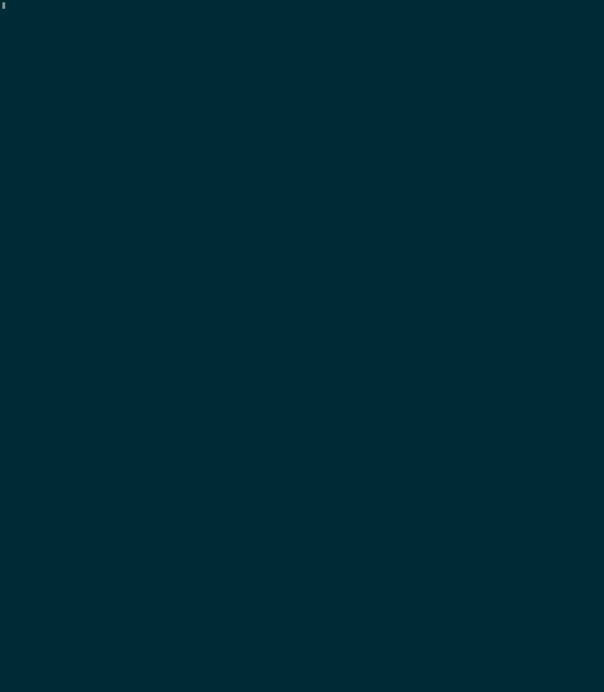

# Getting started

### Prerequisites

To run this node, you must have the follow software installed on your local machine:

- Docker (including docker-compose)
- Python 3
- Virtualenv (`sudo apt install python3-venv`)
- Openssl
- Git

### Cloning this repository

```bash
# Clone repository
git clone https://github.com/ActorForth/bch-devsuite.git
cd ./bch-devsuite

# Setup virtualenv
python3 -m venv venv
source ./venv/bin/activate

# Install script dependencies
pip install -r requirements.txt
```

### Configuration

bch-devsuite initialize the infrastructure from configuration file, see configuration for more details.

### Setup infrastructure

#### 1. Generate configuration

You can run this command and follow the command-line wizard

```bash
./bch-devsuite build-config /tmp/bch-devsuite.toml
```


or create a config file by hand, note that you can remove the part if you don't want that component.

```toml
# Example TOML config file

network = "mainnet" # mainnet | testnet | regtest
rest_service = "bchrest" # bchrest or bchapi
exposed_ports = true
docker_network = "bch-devsuite-network" # docker-network name

[local_node] # Local node configuration
node = "bu" # bu (bitcoin unlimited) or bchn bitcoin cash node
wait_time = 6 # please do not touch this

[slp] # SLPDB
username = "actorforth" # MongoDB username
password = "123ldsfoijqwerj" # MongoDB password

[smartbch] # SmartBCH
enabled = true
test_keys = [ "0b7cdf43329298b26d34d311b25d39f19c60fff25ba45b121284f91e12f17658", "b4d85a7a944b08bab74d0e9e9d612ee409649b382e4de500ee3bd7b7e9c6954f", "216fe772968f326d1b992da744db79fcf06cf6f1142d18086fb4b5a7005cdb8f", "adb378c6b0b9b9cb6190c88cbcaa992388f8e37f1d9c7fc791d08201d04047dc", "09b13dbd311823699802bad7240315021f9e79fe029cc0c0a7a15ab614f303d3", "7c5f4f8eb1f8a82dc9f243350082a1542b2d77d09832023b5cf8f158196a717e", "2917909f71ca82665e6f9ab50b05ecc869f49b9157d0b17976ccd000b3987e29", "989a02864785024b8488d4b22bbdea98048389c18879c18a95e72fbca11c0048", "e473abfa2982915d2cadb204dd41e41afce1b4e8851783a6b1356f5e6784774b", "e3bab3da3a55ac52b241f5d4c2066125b47e197316339540536f66ff92f38585"] # test accounts, only needed for regtest

[bch_rpc_conf]
host = "http://bch-node" # BCH RPC host, leave it to be "http://bch-node" if you also run BCH local node with bch-devsuite
port = "8332" # BCH RPC port
username = "actorforth" # BCH RPC username
password = "BWrzap0bqMjezoeHtOzgOOcUgzkxaL6w" # BCH RPC password
```

#### 2. Init infrastructure

Run:

```bash
./bch-devsuite init -f /tmp/bch-devsuite.toml
```

This command will read configuration file, generate files, check necessary softwares is installed, and then it will download and prepare the docker containers.


### Running infrastructure

Execute the _services_ script to start the node, indexer, rest API, and/or SLPDB (depending which ones defined in configuration file).

```bash
./bch-devsuite start
```

### Testing

```bash
./bitcoin-cli getblockchaininfo
```

Expected result

```json
{
  "chain": "regtest",
  "blocks": 200,
  "headers": 200,
  "bestblockhash": "0714183b15ac3757e35152fadbc0fd2d73ec97c4d9e1ee486882b18da8b256ca",
  "difficulty": 4.656542373906925e-10,
  "mediantime": 1614598375,
  "verificationprogress": 1,
  "initialblockdownload": false,
  "chainwork": "0000000000000000000000000000000000000000000000000000000000000192",
  "size_on_disk": 48350,
  "pruned": false,
  "softforks": [
    {
      "id": "bip34",
      "version": 2,
      "reject": {
        "status": false
      }
    },
    {
      "id": "bip66",
      "version": 3,
      "reject": {
        "status": false
      }
    },
    {
      "id": "bip65",
      "version": 4,
      "reject": {
        "status": false
      }
    }
  ],
  "bip9_softforks": {},
  "bip135_forks": {}
}
```

### Stop infrastructure

Once you decide to call it a day, you can shut down your local environment by executing:

```bash
./bch-devsuite stop
```

### Cleaning Up

If you experience any issues, or would like to completely erase the current wallet and node containers, run the following script:

```bash
sudo ./clean
```

**NOTE:** this command may need to be ran with sudo while on linux

**WARNING:** The 'clean' script is very destructive, so make sure you only use it when you want to _completely erase_ the entire current instance of nodes and the wallet.
