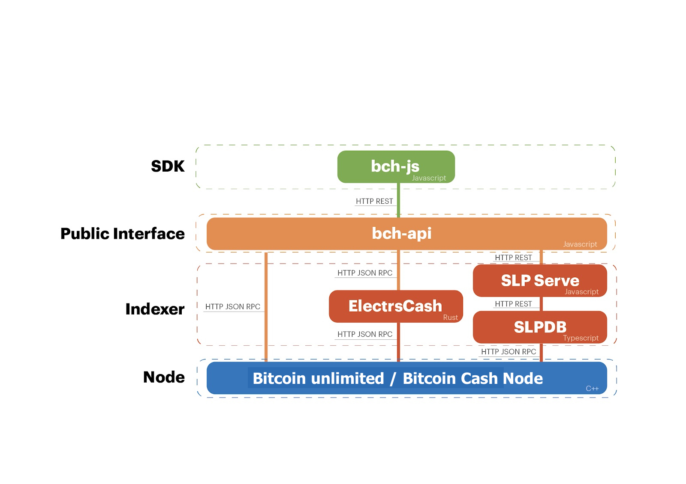

# Architecture

Two REST APIs can be run: [rest.bitcoin.com](https://github.com/ActorForth/rest.bitcoin.com) and [bch-api](https://api.fullstack.cash/docs/).

#### 1. rest.bitcoin.com tech stack

All these components work together in a stack, which means that if the lower part is missing then some of the API in [rest.bitcoin.com](https://github.com/ActorForth/rest.bitcoin.com) might not function properly.

The main reason why you should use all of our fork stacks is because we maintain and guarantee that all of the components will work well with the Regtest address format. Allowing you to test locally more easily.

The blue part is the node that you choose. The default node is Bitcoin unlimited and there is Bitcoin Cash node as an option as well. Currently, this node is always required.

The red part is an indexer. ElectrsCash is for indexing Bitcoin cash transactions and aggregate BCH balance per address. Without these, you won't be able to query the amount of BCH you own in a particular address. OpenSight is a shim micro service to make ElectrsCash compatible with [rest.bitcoin.com](https://github.com/ActorForth/rest.bitcoin.com) API interface. [SLPDB](slp.dev/tooling/slpdb/#what-is-slpdb) is an indexer for SLP token, color coin on top of Bitcoin Cash, this will be verified if the data relate to the color coin is valid and checks if the coin follows the SLP off-chain consensus.

The orange part is [rest.bitcoin.com](https://github.com/ActorForth/rest.bitcoin.com) API, a unified interface for anyone to interact with all of these complex services through REST API interface uniformly

The green part is the client SDK that will interact with [rest.bitcoin.com](https://github.com/ActorForth/rest.bitcoin.com) interface. [Bitcash](https://github.com/ActorForth/bitcash) is written in Python and [Bitbox](https://github.com/ActorForth/bitbox-sdk) is written in typescript.

#### 2. Chris Troutner JS tech stack

The main difference is the rest interface. bch-api has a different API from rest.bitcoin.com and can talk directly to Electrscash without requiring the shim.
